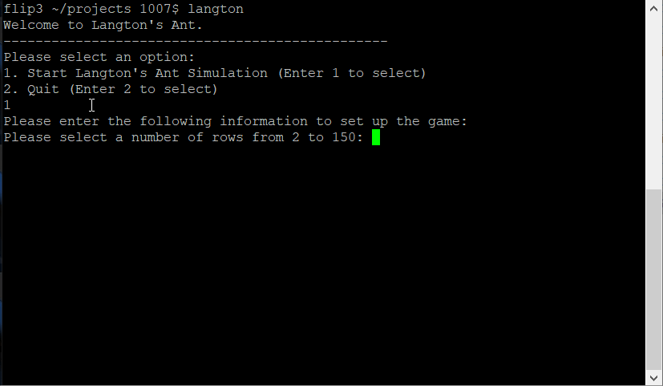

# *Langton's Ant*

**Langton's Ant** is a version of the Langton's Ant simulation.  In this version, the user can select the size of the grid and how many steps the ant will take.  The ant stays on the board by turning 90 degrees until it can step forward when the edge of the grid is hit.

# Compile instructions

Make sure that all files, including the provided makefile are in the same folder. Compile the Langton's Ant program using the following command: make

After compilation, run the program by typing: langton

## Video Walkthrough

Here's a walkthrough:

GIF created with [LiceCap](http://www.cockos.com/licecap/).
